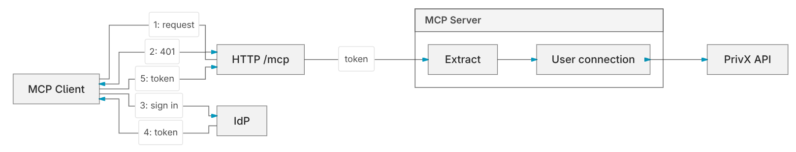
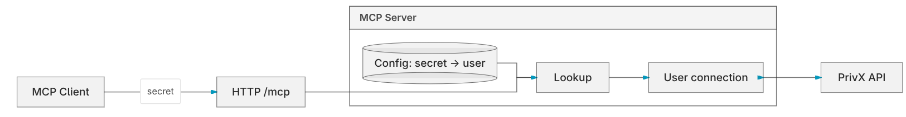

# SSH - PrivX MCP Server

An MCP (Model Context Protocol) server written in Go providing agents secure access to resources in a [PrivX](https://www.ssh.com/products/privileged-access-management-privx) instance.

Secure access starts with identity. The server runs in `oauth` or `m2m` (machine-to-machine) mode: an IdP token or a service secret is mapped to a PrivX user, and that user's roles decide which resources they can see, add, or update.

An [mcp proxy](docs/manual/reference/clients/privx-mcp-proxy.md) is also available for clients that have issues with streaming, OAuth, etc.

## Architecture

The MCP server uses the [official MCP Go SDK](https://github.com/modelcontextprotocol/go-sdk). While other good libraries exist, we use the official SDK to more easily adapt to protocol changes. The server supports both stateless and session-based operation: it creates a session when a session ID is received, otherwise it runs stateless.

In both modes, tools run as the mapped PrivX user, and PrivX's audit log records that identity.

### `oauth` mode

The client signs in at an IdP; the server maps the token's identity claim to a PrivX user.

### `m2m` mode

Machine-to-machine mode is for automated clients with no interactive sign-in. The client sends a service secret; the server maps that secret to one PrivX user.

## Prerequisites

- Go 1.26.5+
- A PrivX instance with API Client and External Token Authentication configured
- An RSA key pair (the public key registered in PrivX External Token configuration)
- For `oauth`: an IdP issuing OIDC tokens

## Security Precautions

The server fronts PrivX, a privileged access management platform. Anyone who can reach it and authenticate can act on PrivX resources with their mapped user's roles, so treat it with the same care as PrivX itself.

- **Limit access.** Only grant access to users who really need it, and keep their PrivX roles as narrow as possible.
- **Use HTTPS.** Serve TLS directly or put the server behind a TLS-terminating reverse proxy. Never expose plain HTTP outside a trusted host.
- **Choose client LLMs carefully.** Use good quality models that resist prompt injection and follow instructions reliably. If possible, use your own trained or self-hosted model.
- **Keep the server on the local network** where possible, rather than exposing it to the internet.
- **Use** `m2m` **mode only for automated access.** Interactive users should sign in through `oauth` mode so that actions are tied to their own identity.

## Documentation

- [Documents Hub](docs/README.md)
- [Manual](docs/manual/README.md)
- [Developer guide](docs/development/DEVELOPMENT.md)
- [Deployment](deploy/README.md)
  - Examples of how to deploy (Docker, Systemd)
  - Doing a local deployment (Docker + Keycloak) for evaluation purposes

## **Support & Commercial Services**

This is a public open-source project licensed under [Apache 2.0](LICENSE) and not covered by standard support SLA. Community feedback and contributions are welcome. Support is provided on a best-effort basis only. For dedicated support, customisations, or enterprise assistance, please raise a ticket via our support portal ([https://care.ssh.com](https://care.ssh.com)) or via your local support partner. Any requests would be assigned to your account manager.
