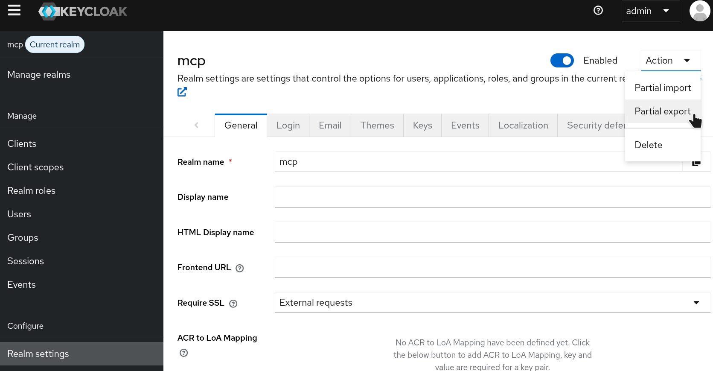
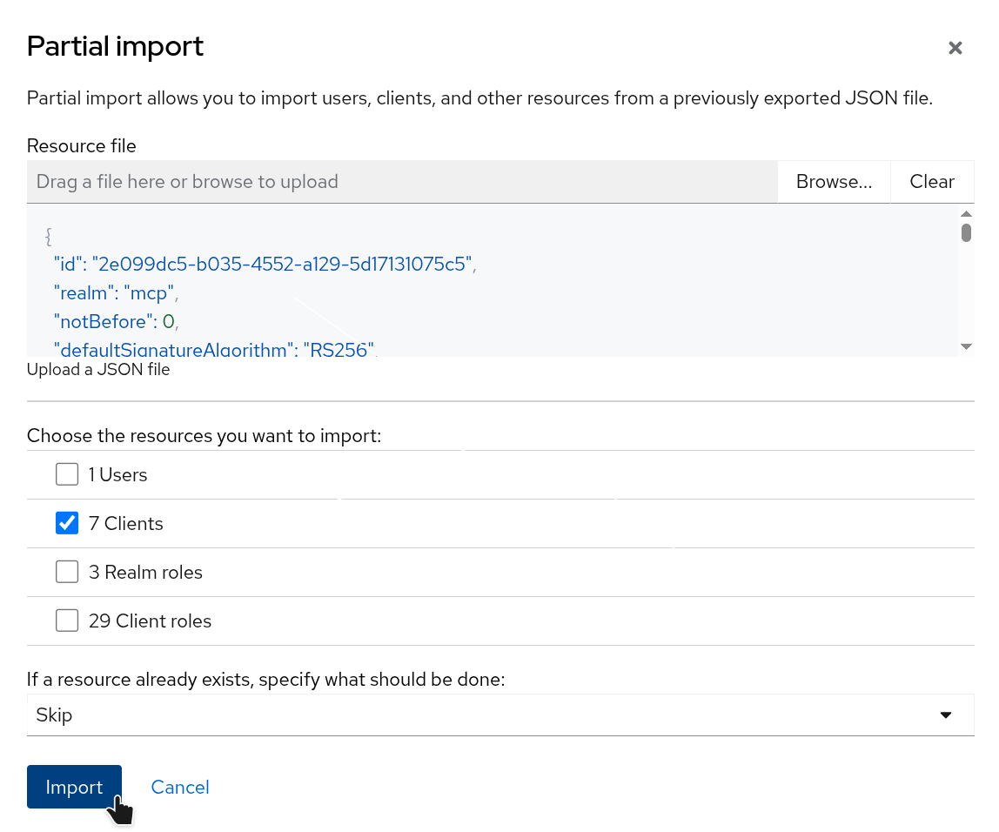
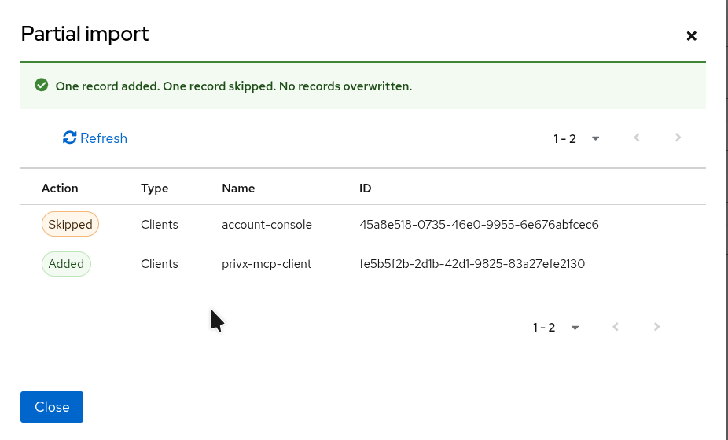
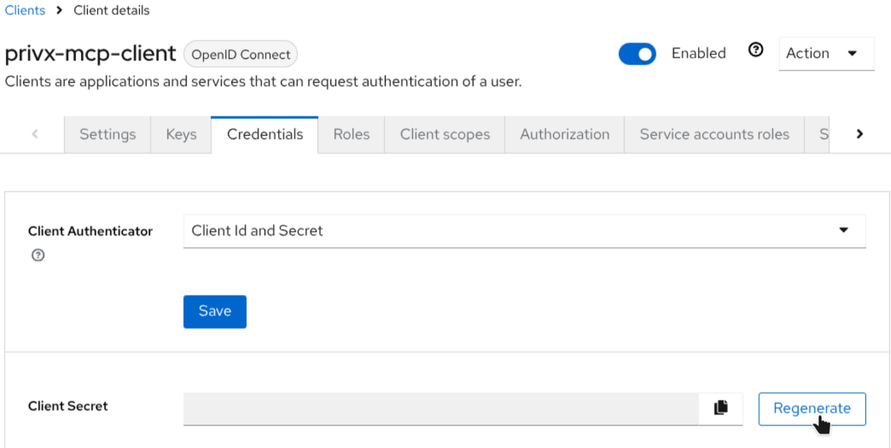

# Local Docker demo

Start a local **Keycloak** + **PrivX MCP server** stack. You need an existing PrivX test/dev instance.

This document is the **demo import shortcut** path. For manual Keycloak setup in production-style environments, use [Keycloak](../../../docs/manual/reference/oidc/keycloak.md).

## Navigation

- **Back to flow**: [Manual](../../../docs/manual/README.md)
- **Manual provider setup**: [Keycloak](../../../docs/manual/reference/oidc/keycloak.md)
- **Client connection**: [MCP client configuration](../../../docs/manual/reference/clients/CLIENTS.md)

Run every command from the **repository root**.

These instructions assume everything runs on **localhost**. To access Keycloak from a remote address it must serve HTTPS (requires an SSL certificate) or sit behind an HTTPS proxy such as NGINX. Remote setups are out of scope for this document.

## 1. Create `.env`

```bash
cp deploy/docker/demo/.demo-env .env
```

Fill in the missing values in `.env` (replace the `<...>` placeholders, including the brackets).

If you do not already have an RSA key pair, create one.

```bash
mkdir -p .pem
openssl genrsa -out .pem/private-key.pem 2048
openssl rsa -in .pem/private-key.pem -pubout -out .pem/public-key.pem
```

Point `PRIVX_RSA_KEY_FILE` at the absolute path of `private-key.pem`. The file must exist before you start Compose.

## 2. Start Keycloak

Start only Keycloak first. The MCP server requires the `mcp` realm to exist, so it must be created before the server starts.

```bash
docker compose up --build keycloak
```


| Service  | URL                                            | Notes                                 |
| -------- | ---------------------------------------------- | ------------------------------------- |
| Keycloak | [http://localhost:8080](http://localhost:8080) | Admin user `admin` / password `admin` |


You can check the logs, to see if there are issues: `docker logs privx-mcp-server | keycloak`

## 3. Create the `mcp` realm and import the client

1. Open [http://localhost:8080](http://localhost:8080) and sign in as `admin`.
2. Create a new realm named `mcp`.
3. Open **Realm settings**. From **Action**, choose **Partial import**:
  
4. Click **Browse...** and select `[deploy/docker/demo/realm-export.json](realm-export.json)`.
  Check **Clients**, choose **Skip** for existing resources, then **Import**:
   
5. Confirm that `privx-mcp-client` was added:
  


## 4. Start all containers

Now that the `mcp` realm exists, start the full stack:

```bash
docker compose up --build
```


| Service    | URL                                            |
| ---------- | ---------------------------------------------- |
| Keycloak   | [http://localhost:8080](http://localhost:8080) |
| MCP server | [http://localhost:8181](http://localhost:8181) |


Check the logs if there are issues: `docker logs privx-mcp-server` or `docker logs keycloak`.

## 5. Client secret

Open **Clients** → `privx-mcp-client` → **Credentials** and click **Regenerate** to create the secret.



When an AI client asks for a client secret while setting up the MCP server, this is it. You can copy it from this page whenever you need it; there is no need to copy it before the client asks.

## 6. Create a Keycloak user that matches a PrivX user

1. Open **Users** and create a user whose **Username** matches an existing PrivX user. Make sure the PrivX user is in the "Local users" directory.
2. Turn **Email verified** on.
3. On the **Credentials** tab, set a password and turn **Temporary** off.


## 7. PrivX: External Token Provider

The OAuth login (Keycloak) yields a username. The MCP server uses that name to find a matching PrivX user. This demo looks in **Local users**; the same flow works with Entra ID, AD, or another directory.

To open a PrivX API connection *as that user*, PrivX must trust a short-lived token minted by the MCP server. That trust is configured as an **External Token Provider**. The Key ID, issuer, audience, etc must match values in `.env`.

In PrivX: **Administration** → **Deployment** → **External Token Provider** → **Add provider**.


| Field                          | Value                                            |
| ------------------------------ | ------------------------------------------------ |
| Name                           | `mcp-provider` (any name is fine)                |
| Users Directory                | Local users                                      |
| Subject type                   | `plain` (`PRIVX_SUBJECT_FORMAT`)                 |
| Public Key Method              | Use token provider public key                    |
| Key ID                         | `privx-aws-mcp-demo` (`PRIVX_RSA_KEY_ID`)        |
| Issuer                         | `privx-mcp` (`PRIVX_TOKEN_ISSUER`)               |
| Service Name in Audience Claim | `privx-mcp-client` (`PRIVX_AUDIENCE`)            |
| Public Key                     | Paste the full contents of `.pem/public-key.pem` |


The import file already includes the Keycloak audience mapper used by this project. If you build clients manually instead of importing, configure it as shown in [Audience mapper](../../../docs/manual/reference/oidc/keycloak.md#audience-mapper).

## 8. Connect an AI client

See [MCP client configuration](../../../docs/manual/reference/clients/CLIENTS.md) for how to point your AI client at this MCP server.

To avoid most OAuth callback issues, put [privx-mcp-proxy](../../../docs/manual/reference/clients/privx-mcp-proxy.md) between the AI client and the MCP server.

If you connect the client directly (no stdio proxy), it must use a redirect URI that Keycloak allows. The imported `privx-mcp-client` already includes common callback URLs. Add any missing ones on that client's **Settings** tab (**Valid redirect URIs**).