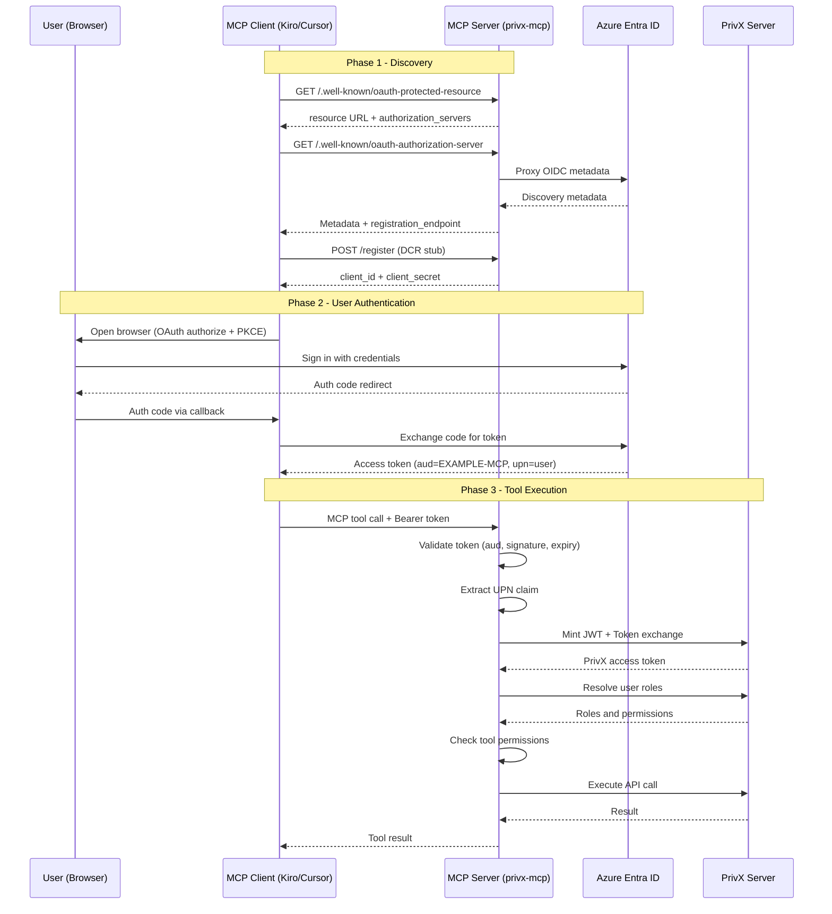

# Entra ID authentication flow

## Related documents

- [Microsoft Entra ID](ENTRA-ID.md)
- [OIDC configuration](../OIDC.md)
- [PrivX configuration](../../server/privx.md)

```mermaid
sequenceDiagram
    participant User as User (Browser)
    participant Client as MCP Client (Kiro/Cursor)
    participant Server as MCP Server (privx-mcp)
    participant Azure as Azure Entra ID
    participant PrivX as PrivX Server

    Note over Client,Server: Phase 1 - Discovery
    Client->>Server: GET /.well-known/oauth-protected-resource
    Server-->>Client: resource URL + authorization_servers
    Client->>Server: GET /.well-known/oauth-authorization-server
    Server->>Azure: Proxy OIDC metadata
    Azure-->>Server: Discovery metadata
    Server-->>Client: Metadata + registration_endpoint
    Client->>Server: POST /register (DCR stub)
    Server-->>Client: client_id + client_secret

    Note over User,Azure: Phase 2 - User Authentication
    Client->>User: Open browser (OAuth authorize + PKCE)
    User->>Azure: Sign in with credentials
    Azure-->>User: Auth code redirect
    User->>Client: Auth code via callback
    Client->>Azure: Exchange code for token
    Azure-->>Client: Access token (aud=EXAMPLE-MCP, upn=user)

    Note over Client,PrivX: Phase 3 - Tool Execution
    Client->>Server: MCP tool call + Bearer token
    Server->>Server: Validate token (aud, signature, expiry)
    Server->>Server: Extract UPN claim
    Server->>PrivX: Mint JWT + Token exchange
    PrivX-->>Server: PrivX access token
    Server->>PrivX: Resolve user roles
    PrivX-->>Server: Roles and permissions
    Server->>Server: Check tool permissions
    Server->>PrivX: Execute API call
    PrivX-->>Server: Result
    Server-->>Client: Tool result
```
