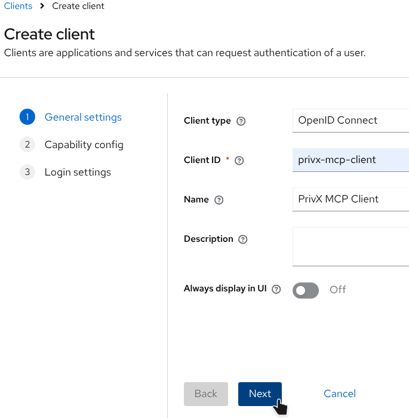
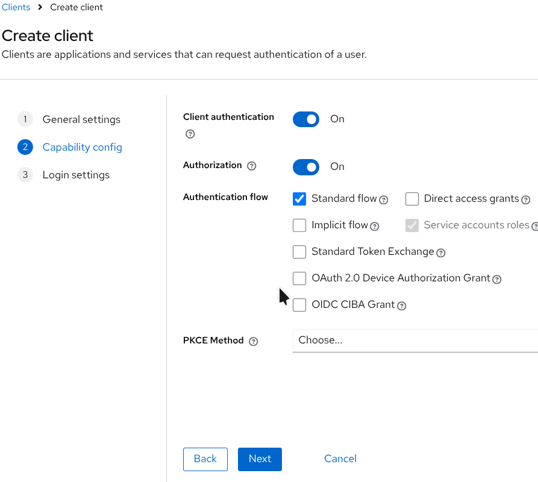
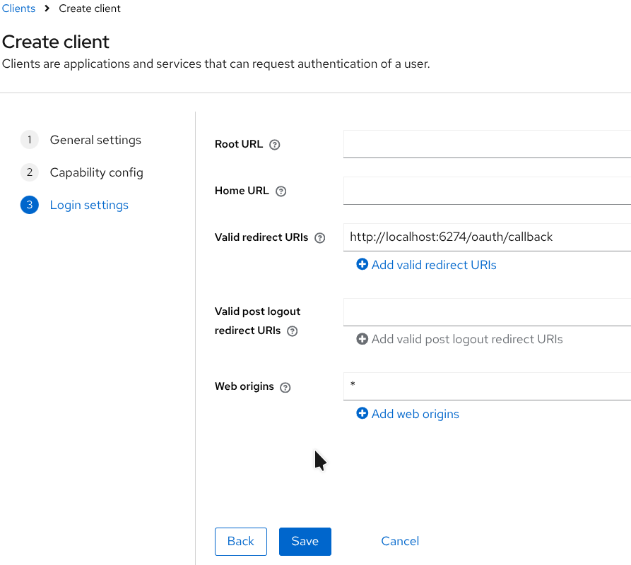
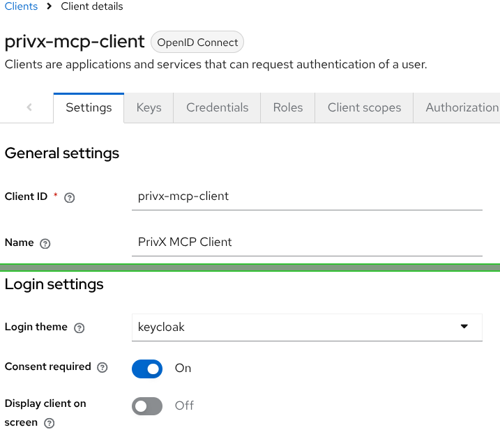
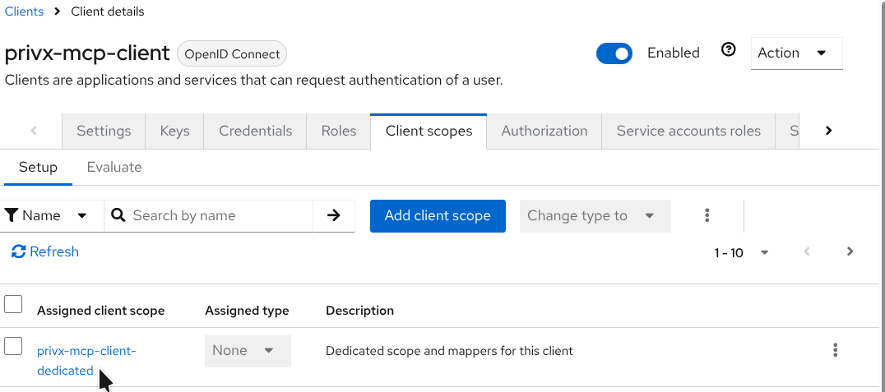
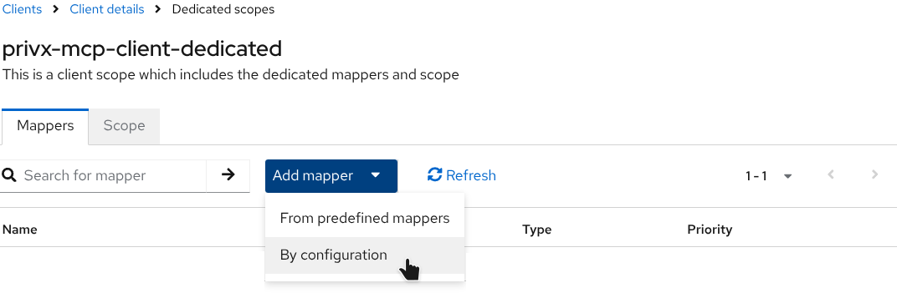
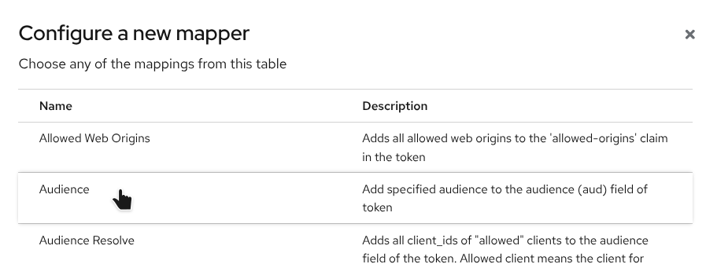
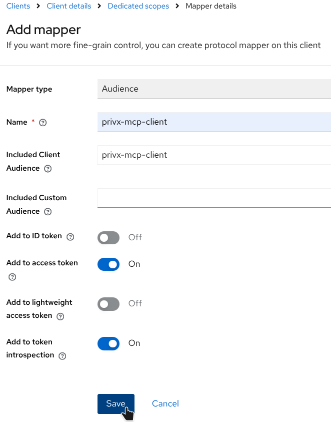

# Keycloak

Manual Keycloak setup as the identity provider for this MCP server. It applies to every MCP client, including the [privx-mcp-proxy](../clients/privx-mcp-proxy.md) stdio bridge. For a local import-based shortcut, use the [Local Docker demo](../../../../deploy/docker/demo/README.md).

## Related documents

- [OIDC configuration](OIDC.md)
- [Microsoft Entra ID](entra-id/ENTRA-ID.md)
- [MCP client configuration](../clients/CLIENTS.md)
- [privx-mcp-proxy](../clients/privx-mcp-proxy.md)
- [Local Docker demo](../../../../deploy/docker/demo/README.md)

## Realm and user configuration

If you are starting with a blank Keycloak configuration:

1. Create a realm, for example `mcp`.
2. Add the users who will authenticate MCP clients to that realm. The default user settings are sufficient, and users do not need any specific Keycloak groups or roles.

Each user's **username** or **email** must be resolvable through these settings from [privx-mcp-config-example.toml](../../../../privx-mcp-config-example.toml):

- `[oauth].identity_claim_field`
- `[oauth].identity_mapping_rule`

For example, with `identity_claim_field = "email"` and `identity_mapping_rule = "as-is"`, the email in the OAuth token must equal the PrivX principal, such as `user@example.com`.

## Client

Add a new client under **Clients → Create client**. This opens a multi-step dialog, and only the options below need changing.

### Create client dialog

| Field                                | Value                                                                 |
| ------------------------------------ | --------------------------------------------------------------------- |
| Client type                          | OpenID Connect                                                        |
| Client ID                            | Identifier to be used by MCP clients. For example: `privx-mcp-client` |
| Client authentication                | On                                                                    |
| Authorization                        | On                                                                    |
| Authentication flow                  | Standard flow                                                         |
| Root URL                             | See [Keycloak redirect URIs](#keycloak-redirect-uris) below           |
| Valid redirect URIs                  | See [Keycloak redirect URIs](#keycloak-redirect-uris) below           |
| Web Origins                          | Limit to certain CORS origins, `*` to permit all                      |
| -                                    |                                                                       |
| **After creating the client config** | **open it and set the following options** `On`                        |
| Consent required                     | On                                                                    |

Example:









### Configure credentials tab

On the **Credentials** tab, generate a new client secret and **Save**.

| Field                | Value                                                                                               |
| -------------------- | --------------------------------------------------------------------------------------------------- |
| Client Authenticator | Client Id and Secret                                                                                |
| Client Secret        | Must be provided together with Client ID by MCP clients, unless dynamic registration (DCR) is used. |

Example:


## Audience mapper

The MCP server compares the `aud` claim of the access token against the `[oauth].audience` configuration. Keycloak does not add that audience unless you map it, so add an audience mapper under **Client scopes**.

Open the scope named `<client ID>-dedicated`.



Add a **By configuration** mapper.



Pick **Audience** from the list.



You will now see the **Mapper details**.

| Field                      | Example                 |
| -------------------------- | ----------------------- |
| Included Client Audience   | Pick the current client |
| Add to access token        | `On`                    |
| Add to token introspection | `On`                    |

Example:



## MCP server configuration

Add the Keycloak and identity-mapping settings to the `[oauth]` table in `privx-mcp-config.toml`:

```toml
[oauth]
issuer_url = "https://keycloak.example.com/realms/your-realm"
audience = "privx-mcp-client"
scopes = ["openid", "profile", "email", "offline_access"]
identity_claim_field = "email"
identity_mapping_rule = "as-is"
```

`issuer_url` must be your Keycloak realm issuer in this exact form: `http://<host>:<port>/realms/<realm-name>`, or `https://` when TLS is enabled.

## Keycloak redirect URIs

Each AI platform (Copilot, Claude, Cursor, and others) uses its own redirect URL. Take the values from [MCP client configuration](../clients/CLIENTS.md#redirect-uris) rather than inventing Keycloak-specific callbacks, and check your platform's own documentation when a value looks outdated.

`localhost` and `127.0.0.1` are different hosts to Keycloak.

### One callback origin: Root URL and a relative path

When every client you use shares one origin, Root URL can prefix a relative path:

| Field               | Example                                     |
| ------------------- | ------------------------------------------- |
| Root URL            | `http://localhost:3334` (no trailing slash) |
| Valid redirect URIs | `/oauth/callback`                           |

Keycloak resolves that to `http://localhost:3334/oauth/callback`. A trailing slash on Root URL produces a double slash and will not match.

This pattern covers **one** origin only. It cannot cover Cursor's hosted callback and Inspector's `:6274` and `:6276` at the same time.

### Several AI clients: use absolute URLs

List **absolute** URIs under **Valid redirect URIs**, one per line, for each client you use.
